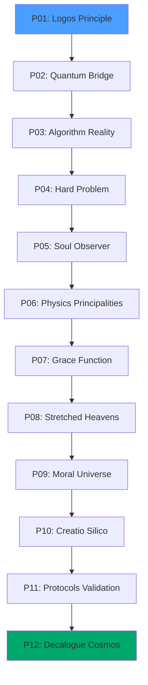

# Paper Flow Diagram

```mermaid
graph TD
    P01[P01: Logos Principle] --> P02[P02: Quantum Bridge]
    P02 --> P03[P03: Algorithm Reality]
    P03 --> P04[P04: Hard Problem]
    P04 --> P05[P05: Soul Observer]
    P05 --> P06[P06: Physics Principalities]
    P06 --> P07[P07: Grace Function]
    P07 --> P08[P08: Stretched Heavens]
    P08 --> P09[P09: Moral Universe]
    P09 --> P10[P10: Creatio Silico]
    P10 --> P11[P11: Protocols Validation]
    P11 --> P12[P12: Decalogue Cosmos]
    
    style P01 fill:#4a9eff
    style P12 fill:#00a86b
```

Generated: 2025-11-26 21:01